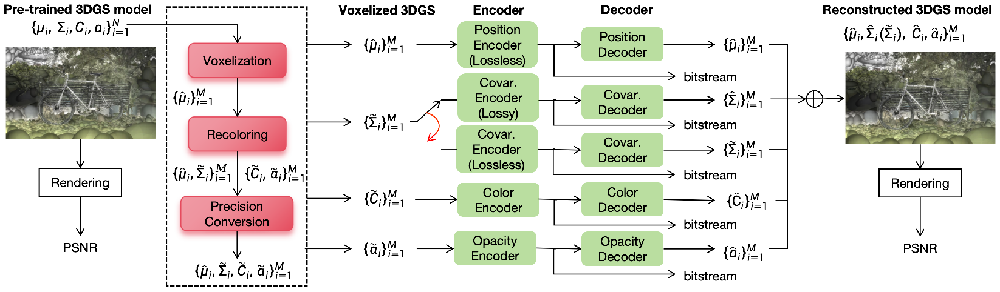

# A GPCC-based Compression Framework for 3D Gaussian Splatting

**Chenjunjie Wang\*, Shashank N. Sridhara\*, Eduardo Pavez\*, Antonio Ortega\*, Cheng Chang†**  
\*University of Southern California, Los Angeles, CA, 
†Meta, Menlo Park, CA  



## Abstract

We present a novel compression framework for 3D Gaussian splatting (3DGS) data that leverages transform coding tools originally developed for point clouds. Contrary to existing 3DGS compression methods, our approach can produce compressed 3DGS models at multiple bitrates in a computationally efficient way. Point cloud voxelization is a discretization technique that point cloud codecs use to improve coding efficiency while enabling the use of fast transform coding algorithms. We propose an adaptive voxelization algorithm tailored to 3DGS data, to avoid the inefficiencies introduced by uniform voxelization used in point cloud codecs. We ensure the positions of larger volume Gaussians are represented at high resolution, as these significantly impact rendering quality. Meanwhile, a low-resolution representation is used for dense regions with smaller Gaussians, which have a relatively lower impact on rendering quality. This adaptive voxelization approach significantly reduces the number of Gaussians and the bitrate required to encode the 3DGS data. After voxelization, many Gaussians are moved or eliminated. Thus, we propose to fine-tune/recolor the remaining 3DGS attributes with an initialization that can reduce the amount of retraining required. Experimental results on pre-trained datasets show that our proposed compression framework outperforms existing methods.


---

## Installation

### 🛠️ Requirements

- **Conda Environment 1 (gaussian_splatting)**  
  👉 [graphdeco-inria/gaussian-splatting](https://github.com/graphdeco-inria/gaussian-splatting)

- **Conda Environment 2 (c3dgs)**  
  👉 [KeKsBoTer/c3dgs](https://github.com/KeKsBoTer/c3dgs/tree/master)

- **Geometry-based Point Cloud Compression (GPCC) Codec**  
  👉 [MPEGGroup/mpeg-pcc-tmc13](https://github.com/MPEGGroup/mpeg-pcc-tmc13)


### Standard Folder Structure
```text
📁 project_root/

├── 📁 attributes_compressed/
├── 📁 code_Adaptive/
│   ├── 📁 Lossless_covar/
│   │   ├── extract_all_pq.py
│   │   ├── postprocess.py
│   │   ├── encoder.py
│   │   ├── decoder.py
│   │   └── codec.py
│   ├── 📁 Lossless_covar/
│   │   ├── extract_all_pq.py
│   │   ├── postprocess.py
│   │   ├── encoder.py
│   │   ├── decoder.py
│   │   └── codec.py
│   ├── 📁 Retrain_3DGS/
│   │   ├── train.py
│   │   ├── render.py
│   │   ├── metrics.py
│   │   └── adapt_voxel_recolor.py
│   ├── 📁 Retrain_PC/
│   │   ├── train.py
│   │   ├── render.py
│   │   └── metrics.py
│   ├── 📁 VQ_script/
│   │   ├── compress.py
│   │   ├── render.py
│   │   └── metrics.py
│   ├── plot_RD.py
│   └── voxelization.py
├── 📁 colmap_dataset/
│   ├── 📁 bicycle/
│   ├── 📁 bonsai/
│   ├── 📁 counter/
│   ├── 📁 drjohnson/
│   ├── 📁 flowers/
│   ├── 📁 garden/
│   ├── 📁 kitchen/
│   ├── 📁 playroom/
│   ├── 📁 room/
│   ├── 📁 stump/
│   ├── 📁 train/
│   ├── 📁 treehill/
│   └── 📁 truck/
├── 📁 original_model/
│   ├── 📁 bicycle/
│   ├── 📁 bonsai/
│   ├── 📁 counter/
│   ├── 📁 drjohnson/
│   ├── 📁 flowers/
│   ├── 📁 garden/
│   ├── 📁 kitchen/
│   ├── 📁 playroom/
│   ├── 📁 room/
│   ├── 📁 stump/
│   ├── 📁 train/
│   ├── 📁 treehill/
│   └── 📁 truck/
├── 📁 test_model/
│   ├── 📁 bicycle/
│   ├── 📁 bonsai/
│   ├── 📁 counter/
│   ├── 📁 drjohnson/
│   ├── 📁 flowers/
│   ├── 📁 garden/
│   ├── 📁 kitchen/
│   ├── 📁 playroom/
│   ├── 📁 room/
│   ├── 📁 stump/
│   ├── 📁 train/
│   ├── 📁 treehill/
│   └── 📁 truck/
├── 📁 RDO/
│   ├── 📁 bpp/
│   ├── 📁 Meta_data/
│   ├── 📁 PSNR/
│   └── 📁 PSNR_per_view/
├── 📁 reconstructed_3DGS/
├── 📁 retrain_model/
├── 📁 voxelized_adapt/
├── 📁 VQ_model/
└── README.md
```

## 📘 Instruction

### Step 1. Configure Conda Environments

Set up two Conda environments:

- `gaussian_splatting`: used for retraining the 3DGS model  
- `c3dgs`: used for VQ-based covariance compression

---

### Step 2. Install the GPCC Codec

Clone and compile the GPCC codec (TMC13) from the official repo:

🔗 https://github.com/MPEGGroup/mpeg-pcc-tmc13

> We compiled it using Visual Studio 2019 on Windows 10.  
> The compiled binary (`tmc3.exe`) is located in:
/build/tmc3/Release/tmc3.exe

---

### Step 3. Prepare the Folder Structure

Download the pre-trained 3D Gaussian Splatting models and COLMAP dataset from the official repository:

🔗 https://github.com/graphdeco-inria/gaussian-splatting?tab=readme-ov-file

- Download the **"Pre-trained Models (14 GB)"** from the repository.  
  Place two copies in your `project_root` directory:
  - Rename the first copy to `original_model`
  - Rename the second copy to `test_model`

- Download the **"Evaluation Images (7 GB)"** and place them in the `project_root` directory.  
  Rename the folder to `colmap_dataset`.

---


### Step 4. Voxelization

Run voxelization and configure retraining parameters:

```bash
conda activate gaussian_splatting
cd code_Adaptive
python voxelization.py --depth_start 15 --voxel_thr 30 --dataset_name train --retrain_mode 3DGS --use_adaptive false --iterations 15000
conda deactivate
```

### Step 5. Compression
Quantization parameters are defined inside `encoder.py` and `decoder.py` scripts for both lossless and lossy compression pipeline

Default QP combination is what we used in our paper at ICIP2025:
```bash
(f_rest_qp, f_dc_qp, opacity_qp) = 
        (40, 4, 16), (40, 4, 34), (40, 4, 40),
        (40, 16, 16), (40, 16, 34), (40, 16, 40),
        (40, 20, 16), (40, 20, 34), (40, 20, 40),
        (40, 24, 16), (40, 24, 34), (40, 24, 40),
        (40, 28, 16), (40, 28, 34), (40, 28, 40),
	(38, 4, 4), (38, 16, 4),
        (34, 4, 4), (34, 16, 4),
        (31, 4, 4), (31, 16, 4),
        (28, 4, 4), (28, 16, 4),
        (38, 4, 16), (38, 16, 16),
        (34, 4, 16), (34, 16, 16),
        (31, 4, 16), (31, 16, 16),
        (28, 4, 16), (28, 16, 16),
        (38, 4, 28), (38, 16, 28),
        (34, 4, 28), (34, 16, 28),
        (31, 4, 28), (31, 16, 28),
        (28, 4, 28), (28, 16, 28),
        (16, 4, 4), (16, 16, 4),
        (4, 4, 4), (4, 16, 4),
        (16, 4, 16), (4, 4, 16),
```
#### Step 5a. Lossy Compression
For a voxelized 3DGS model, launch the compression pipeline using the lossy codec.

```bash
conda activate c3dgs
cd code_Adaptive/Lossy_covar
python codec.py --depth_start 15 --voxel_thr 30 --dataset_name train --retrain_mode 3DGS --use_adaptive false
conda deactivate
```

#### Step 5b. Lossless Compression
Launch the compression pipeline using the lossless codec.

Quantization parameters are defined inside `encoder.py` and `decoder.py` scripts

Default QP combination:
(f_rest_qp, f_dc_qp, opacity_qp) = (4, 4, 4)

```bash
conda activate gaussian_splatting
cd code_Adaptive/Lossless_covar
python codec.py --depth_start 15 --voxel_thr 30 --dataset_name train --retrain_mode 3DGS --use_adaptive false
conda deactivate
```

### Step 6. Rendering and Rate-Distortion Analysis
Render the compressed 3DGS and evaluate rate-distortion performance under different compression ratios:

```bash
conda activate gaussian_splatting
cd code_Adaptive
python plot_RD.py --depth_start 15 --voxel_thr 30 --dataset_name train --retrain_mode 3DGS --use_adaptive false --comp_mode lossless
conda deactivate
```

